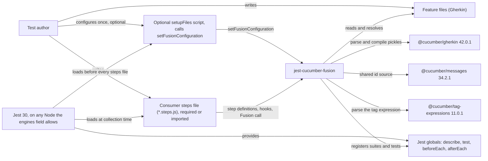
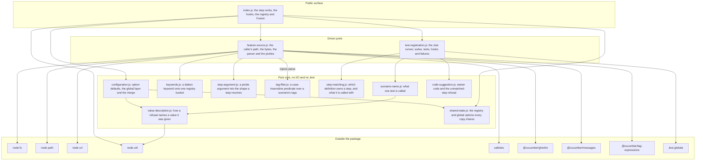
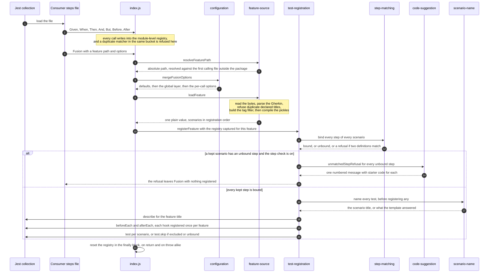
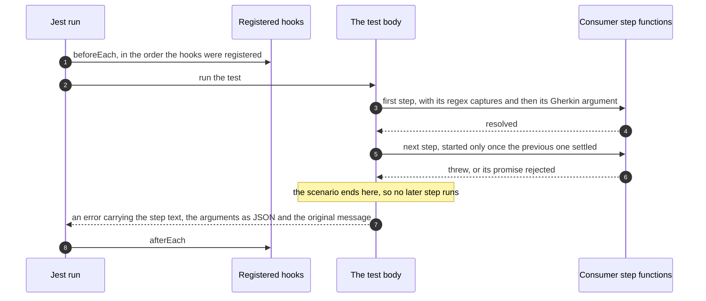

# Architecture

This page is for contributors: how Fusion is built and why. To use the package, start with the [README](../README.md#getting-started). To work on it, clone the repository and follow [Running the examples](./RunningTheExamples.md) to get the suite running, then read on.

## 1. Overview

jest-cucumber-fusion lets you write Gherkin feature files and run them as part of an ordinary Jest run, with coverage, and with no separate Cucumber runner process.

You write step definitions in a `.steps.js` file using the verbs `Given`, `When`, `Then`, `And` and `But`, add `Before` and `After` hooks if you need them, and call `Fusion("your.feature")`. Fusion then owns the whole lifecycle itself: it resolves and reads the feature file, parses the Gherkin, compiles it into pickles (which expands each Scenario Outline into one scenario per Examples row and folds Backgrounds and Rules in), works out which of your definitions owns each step, and registers one Jest `describe` for the feature with one `test` for each scenario. All of that happens synchronously, while Jest is still collecting your test file, so a problem with your feature file or your step definitions is reported before any test runs.

Per call, or once for a whole run, you can pass `errors` (which validations are on), `tagFilter` (a tag expression selecting which scenarios run), `scenarioNameTemplate` (what each test is called) and `loadRelativePath` (accepted and ignored). `setFusionConfiguration` sets the same options once, from a script listed in Jest's `setupFiles`.

### The dependency line, and the dual package

Fusion's source is ES modules, and so are its dependencies, pinned exactly:

| Dependency | Pin | Used for |
|---|---|---|
| `@cucumber/gherkin` | 42.0.1 | parsing a feature file and compiling pickles |
| `@cucumber/messages` | 34.2.1 | the incrementing id source the parser and compiler share |
| `@cucumber/tag-expressions` | 11.0.1 | reading a `tagFilter` expression |
| `callsites` | 4.2.0 | finding the file that called `Fusion`, so a relative feature path resolves against it |

All four publish ES modules only, and Jest cannot `require` an ES module. New projects are recommended to use ES modules, but many existing consumers `require` Fusion from a CommonJS `.steps.js` file under their own Jest, so the package is dual, through the `exports` map in `package.json`:

- `import` resolves to `src/index.js`, the ES module source, for steps written as ES modules under Jest's ES module mode;
- `require` resolves to `dist/index.cjs`, a CommonJS bundle that `scripts/build-cjs.js` builds with esbuild before every pack (the `prepack` script), with the four dependencies inlined. It ships with `dist/THIRD_PARTY_LICENSES.txt`, their MIT notices, and `dist/index.d.cts`, the typings for TypeScript consumers that `require`.

A consumer who mixes the two, for example a `setupFiles` script that `require`s Fusion and steps that `import` it, or a shared step library written as CommonJS used by step files written as ES modules, loads two copies. So everything the copies must share, the step and hook registry and the global configuration, lives in `shared-state.js` on `globalThis`: steps or a global registered through one copy reach the other. The packaged-consumer baseline runs all four shapes against the real tarball. Everything else the package needs comes from Node itself (`fs`, `path`, `url` and `util`) and from Jest's own globals.

Until 3.0.0 the package was CommonJS with no build step, pinned to the last cucumber releases a `require` could load (gherkin 39, messages 32, tag-expressions 9, callsites 3). A spike on 2026-10-09 measured the alternatives on packed builds: an ES module only package broke every CommonJS consumer, while the dual package ran them all unchanged.

## 2. Context

This shows who and what Fusion sits between: the author writes the step definitions and the feature files, Jest loads the step definitions file, and Fusion turns the feature file into registered Jest suites and tests. The optional setup script is loaded by Jest before any step definitions file, which is what lets it configure the whole run.

## 3. Components

This shows every module in `src/` and what imports what. The shape is deliberate: one module reaches the outside world, one module reaches Jest, and everything in between is a set of plain functions over plain values that import nothing but each other and Node's `util`. The `@cucumber/tag-expressions` parse function is imported by `feature-source` and passed into `tag-filter` as an argument, which is why `tag-filter` can own tag matching without depending on the expression library itself.

| Module | Responsibility | Requires |
|---|---|---|
| `index.js` | The public surface. Writes the registry the verbs and hooks register into (kept in `shared-state`), refuses a duplicate matcher in the same keyword bucket, supports the chained form where a step chain returned by one verb is handed to another, and orchestrates one `Fusion` call. It exports no port. | `util`, `configuration`, `feature-source`, `test-registration`, `shared-state` |
| `configuration.js` | The option defaults, the global layer `setFusionConfiguration` writes, and the merge of defaults, then global, then per-call. `errors` merges key by key at every layer, so naming one validation never switches another off, and an option set to `undefined` counts as not set. Refuses a setter argument that is not an options object. The global layer is kept in `shared-state`. | `value-description`, `shared-state` |
| `shared-state.js` | The state every copy of the dual package in one test file must share: the step and hook registry and the global configuration, on `globalThis` under a key naming the major version. A value is created only when absent, so a copy that loads second never resets what the first registered. Jest gives each test file its own global, so the state stays per file. | nothing |
| `value-description.js` | Names a value a refusal was given, as its type and its JSON form, falling back to `util.inspect` for a value JSON cannot hold (a BigInt, a circular object, a function), and never throwing. | `util` |
| `feature-source.js` | Driven port for everything outside the process. Resolves the feature path against the calling file, reads the bytes, parses the Gherkin, checks for duplicate declared scenario titles, builds the tag filter, compiles pickles, recovers each step's keyword, and returns one plain loaded-feature value. The only module that may touch the filesystem, the parser or the caller stack. | `fs`, `path`, `url`, `callsites`, `@cucumber/gherkin`, `@cucumber/messages`, `@cucumber/tag-expressions`, `keywords`, `step-argument`, `tag-filter` |
| `keywords.js` | Maps an AST step keyword, in whatever dialect the feature declared, onto exactly one of the five registry buckets, or refuses. Compiled pickles throw the keyword away, so it has to be recovered and mapped before a lookup can be honest. | nothing |
| `step-argument.js` | Turns a pickle's Gherkin argument into the shape a step function receives: a data table becomes an array of header-keyed row objects, a docstring becomes a string. An empty docstring and a header-only table survive as real values rather than as absence. | nothing |
| `tag-filter.js` | Lowercases the expression and the scenario's tags, then answers whether that scenario is selected. Refuses an expression it cannot read, or one with an operand that is not a tag (`smoke` for `@smoke`), instead of quietly selecting nothing. The parse function is injected. | nothing |
| `step-matching.js` | Finds the one registered definition that owns a step, extracts its regex captures and appends the Gherkin argument when the step carries one. An unbound step is a returned result, so the caller can decide; two matching definitions are a refusal, because there is no reading under which Fusion could pick one. | nothing |
| `scenario-name.js` | Produces the name of one test: the scenario's own title, or the answer from a `scenarioNameTemplate` called with the four documented variables. A template that throws, or that answers with anything other than a non-empty string, is refused. | `value-description` |
| `code-suggestion.js` | Builds the single refusal that names every unbound step of a feature. Steps of one shape (the same text apart from their values, such as the rows of an outline) share one entry and one starter definition, in Fusion's own verb idiom, whose captures cover every one of them, so pasting every snippet at once binds them all. | nothing |
| `test-registration.js` | Driven port over the Jest runner. Binds every step and names every test before registering anything, then registers one `describe`, the hooks once per feature, and one `test` or `test.skip` per scenario. Owns the failing-step decoration. The only module that may name a Jest global. | `step-matching`, `code-suggestion`, `scenario-name`, Jest globals |

## 4. What happens when you call Fusion

### Collection time

This shows one `Fusion` call while Jest is still loading your test file. The important property is in the middle: every step is bound and every test is named before a single `describe` or `test` is registered, so a refusal leaves `Fusion` synchronously with nothing half-registered, and one message can name every unbound step of the feature rather than only the first.

Details worth knowing as a consumer:

- **The feature path is resolved against the file that called `Fusion`**, found as the first stack frame outside the package, so a wrapper inside the package cannot retarget it. With no such frame, the path resolves against the working directory.
- **Registration order is plain scenarios first, then Examples rows**, each group in the order the feature file declares them, with Rule-nested scenarios flattened into the same two groups. This is what keeps generated test names stable for an existing CI history.
- **The duplicate-title check counts declared titles, never generated test names.** One Scenario Outline counts once however many Examples rows it has, so repeated row names are never that refusal.
- **A scenario a tag filter excludes is registered as a skipped test** under the name it would have carried, so it still appears in the report, and its steps are exempt from the unmatched-step check. A feature with no scenarios registers no `describe` at all, and therefore no hooks.
- **The registry is emptied after every `Fusion` call.** A second `Fusion` in the same file starts from a clean slate and needs its own definitions and hooks.

### Run time, for one test

This shows a single registered test running later, after collection. Steps run in order and each one is awaited before the next begins, so a failure stops the scenario where it happened instead of reporting a second, invented failure.

A step function receives its regex captures first, in order, and then the step's Gherkin argument if it has one. The argument is forwarded on presence rather than on type, so an empty docstring and a header-only data table both reach your function.

## 5. Rules the architecture keeps

Jest (a peer dependency: the consumer's own Jest runs the tests) and the `@cucumber` packages (runtime dependencies) are needed by design: gluing Gherkin to Jest is what this package is for. These rules do not keep them out. They keep each dependency in a known place, so the shape above holds over time. They are not conventions in a comment: they are checked by `test/specs/arch/dependency-direction.steps.js`, which reads the `src/` tree as it actually is, so a module added later is governed from the day it arrives.

1. **Each module requires exactly what the table in section 3 lists for it.** The Requires column is the rule: the test compares it with every file's real dependencies (its `import` and `export ... from` statements, dynamic `import()` calls, and any `require`) and fails on any difference in either direction, on a module with no row, and on a dynamic `import()` or `require` whose target is not a plain string. So the filesystem, the parser packages and the caller stack stay in `feature-source`, and the core modules require nothing outside the package except Node's `util`. A deliberate change of design is an edit to the table in the same commit, which makes it visible in review. (Until 2026-10-09 this was two overlapping rules, "only `feature-source` reaches the outside world" and "the core requires only itself"; the first missed a `path` or `url` require outside the core, and neither noticed the table drifting from the code.)
2. **Only `test-registration` touches a Jest global.** Running under Jest is the product, so this is not about leaving Jest. It keeps registration order (every step bound before anything is registered, each hook once per test, a skipped scenario as `test.skip`) in one module, which is where this package's real bugs have lived. ESLint enforces it (`eslint.config.js`), by name and through `globalThis` or `global`, and knows scope, so a local `const it` or an object key `test:` is not mistaken for the global; the architecture test pins that config and lints the real tree with it.
3. **`index.js` exports exactly nine names:** `Given`, `When`, `Then`, `And`, `But`, `Before`, `After`, `Fusion` and `setFusionConfiguration`. The two driven ports are internal module paths and are never exported, so an internal seam cannot quietly become part of the public contract.

A fourth rule is worth stating even though it is about messages rather than modules: the text a consumer sees on a failure is part of the contract. The failing-step decoration, the missing-feature-file message, the Gherkin parse error, the duplicate step definition and duplicate title refusals, the ambiguous and unmatched step refusals, and the tag filter and name template refusals are all fixed text, so anything that greps your test output keeps working across a release.
