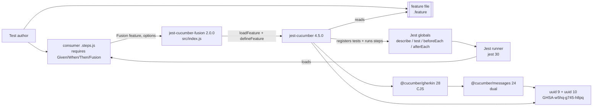
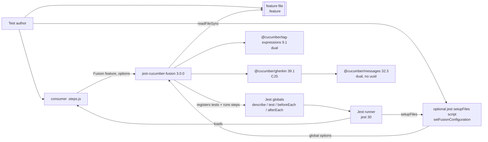
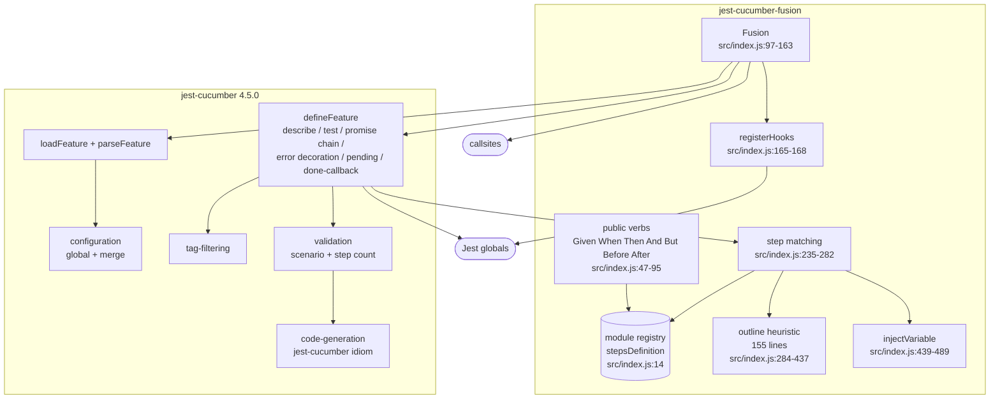
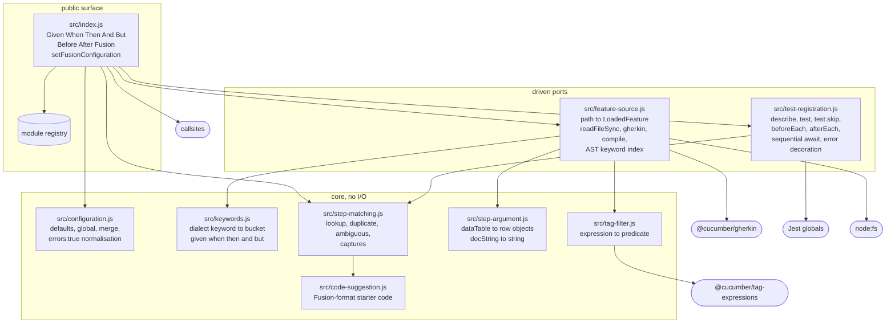
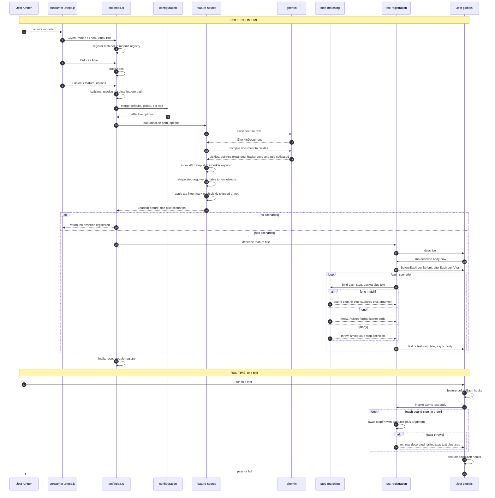

# Architecture pass: dropping jest-cucumber

> **Status: pre-DESIGN options paper, 2026-10-07.** This is input to Gearoid's decisions, not the
> binding design. Once he rules, the decisions are fed through `des design`, and DES writes the
> durable brief and ADR. Produced by `nw-solution-architect` (read-only pass); load-bearing claims
> re-verified by Koru against source and by probe, as marked. **UNREVIEWED: no paired reviewer has
> run on this paper**; the independent review points come later in the delivery (acceptance review,
> implementation review, examine).

## Why this is bigger than a dependency swap

jest-cucumber is not a thin parser for Fusion. It owns the whole test lifecycle: reading and parsing
the feature, expanding outlines, building describe and test blocks, running steps in order,
decorating failures, tag filtering, name templates, validation and starter-code generation. Removing
it means Fusion takes over each of those, so each becomes a decision about what consumers see.

## Dependency route (R1, measured)

The newest cucumber packages are ESM-only, and Jest 30 on Node 22 cannot `require()` them
(`Must use import to load ES Module`, `jest-runtime/build/index.js:452`; Jest supports
`require(esm)` only on Node 24.9+). Fusion registers tests synchronously while Jest loads the
consumer's `.steps.js` file, so it must stay CommonJS. The last CommonJS line, verified under Jest 30
on Node 22 with `npm ls uuid` empty:

| Package | Version | Why this one |
|---|---|---|
| `@cucumber/gherkin` | 39.1.0 | Last major without `"type": "module"`. 40+ is ESM-only. |
| `@cucumber/messages` | 32.3.1 | Dual export (`require` condition). Deps: `reflect-metadata`, `class-transformer`. No `uuid`. |
| `@cucumber/tag-expressions` | 9.1.0 | Last dual-published version. 10+ is ESM-only. |

Cost: pinned to majors upstream has moved past. Moving forward needs Node 24.9+ for every consumer,
or Fusion itself going ESM.

## Diagrams

### Context today

The consumer's `.steps.js` is the entry point; jest-cucumber sits between Fusion and both the Gherkin
parser and Jest, and it is the only route to the `uuid` advisory.

### Context proposed

The middleman is gone: Fusion reads the feature, compiles pickles, and talks to the Jest globals
directly. An optional setup script carries global options.

### Components today

One 498-line module, with every lifecycle responsibility delegated across the jest-cucumber seam.

### Components proposed

A public surface, a pure core with no I/O, and two driven ports (feature source and test
registration). Dependencies point inward. The two ports are also the internal test seam that
replaces `jest.mock("jest-cucumber")` (D10).

### Collection time and run time

What happens when Jest loads a `.steps.js` file, then when it runs one of the tests that file
registered.

## Responsibility inventory (summary)

Thirty-five responsibilities were traced; full table in the architect's report. The ones that
drive decisions:

| Responsibility | Today | Proposed |
|---|---|---|
| Parse, Background, Rule, outline expansion, `<var>` substitution in title, steps, tables, docstrings | jest-cucumber AST walk (`parsed-feature-loading.js:88-186`) | Gherkin `compile` (pickles). Closes L5 by construction. |
| Gherkin keyword per step (`And` vs `Given`) | `parsed-feature-loading.js:65-71` | **Lost by pickles** (verified: both read `type: "Context"`). Recover via `PickleStep.astNodeIds` to the AST step (D1). |
| Outline matching heuristic | `src/index.js:284-437` (155 lines, home of L2 and L4) | Deleted: pickle text is already concrete (D2). |
| Done-callback arity heuristic and the rest-param workaround | `feature-definition-creation.js:132-148`, `src/index.js:451-467` | Deleted: always arity 0 for Fusion today. |
| Sequential async step execution | `feature-definition-creation.js:119-159` | `src/test-registration.js`, an async test body awaiting each step. |
| Failing-step error decoration | `feature-definition-creation.js:153-157` (verified) | D7. |
| `pending()` source sniff that silently skips | `feature-definition-creation.js:85-100` (verified) | D6. |
| Tag filter | hand-rolled `new Function` rewriter, lowercased (`tag-filtering.js:33,46,55`, verified) | D4. |
| Global config | `setJestCucumberConfiguration` | D-A. |
| Validation and starter code | step-count check, jest-cucumber idiom | D-B. |

## Decision register

Each entry: what it is, the options, the architect's recommendation, and whether consumers see it.

| ID | Question | Recommended | Alternatives | Consumer-visible |
|---|---|---|---|---|
| **D-A** | What replaces `setJestCucumberConfiguration()`? | **A1** `setFusionConfiguration(options)` export, same merge order `defaults < global < per-call` | A2 config file discovery (cannot carry the `scenarioNameTemplate` function in JSON); A3 env vars (same problem); A4 drop global config | Yes, breaking: import moves to this package |
| **D-B** | Missing-step and validation experience | **B1 + B3**: one Fusion-owned error, always loud, with starter code in Fusion's idiom (`Given("...", () => {})`, or a regex with captures when the text holds numbers or quoted strings). `stepsMustMatchFeatureFile` gates it; `errors: false` turns the scenario into a **visible skip**, never a silent pass. `scenariosMustMatchFeatureFile` gates a duplicate-scenario-title check. `allowScenariosNotInFeatureFile` accepted as vestigial | B2 replicate both of today's messages (keeps problem B unfixed) | Yes, breaking: message, suggestion format, `errors: false` meaning |
| **D1** | How to recover `given/when/then/and/but` per step | **1a** AST keyword index via `astNodeIds`, resolved through Gherkin dialects (i18n for free) | 1b port the AST walk (re-inherits L5); 1c one bucket for all keywords (breaks shadowing semantics) | No |
| **D2** | Delete the 155-line outline heuristic | **2a** delete; match pickle text like any scenario | 2b keep as fallback (two regimes) | Possibly: a definition that only bound via the heuristic would now report unmatched. Release note "outline steps now match their substituted text" |
| **D3** | Step-argument shape | Port: table to row objects, docstring to string, forward on presence, keep `""` and `[]` | (none) | No |
| **D4** | Tag-filter engine | **4a** `@cucumber/tag-expressions@9.1.0`, lowercasing expression and tags to keep case-insensitivity | 4b no lowercasing (silent change); 4c port the `new Function` rewriter | Edge cases only (error wording) |
| **D5** | `scenarioNameTemplate` is a no-op on outline rows today (verified: `feature-definition-creation.js:197` vs `:209`) | **5b** apply to every test, using the row's expanded title | 5a replicate the bug | Yes, only for template users with outlines. Touches the byte-identical-names decision, so needs Gearoid's nod |
| **D6** | The `pending()` silent skip | **6a** drop it | 6b replicate; 6c real `Pending()` verb (new scope) | Yes, minor: a previously skipped test would run |
| **D7** | Failing-step error decoration | **7a** byte-identical for 3.0.0; richer WHAT/WHY/HOW message (with feature file and line) as a follow-up | 7b improve now; 7c drop (rejected) | No under 7a |
| **D8** | Missing feature file message | Keep `Feature file not found (<abs path>)`, append the resolved base directory as a HOW | keep exactly | Minor |
| **D9** | `loadRelativePath` | Already decided: typed no-op. Docs must say so | (none) | Docs only |
| **D10** | Internal test seam (8 files mock jest-cucumber) | **10a** mock `src/feature-source` and `src/test-registration` by path; promote `l2` and `l4` to real feature files | 10b runtime `__setPorts` export; 10c public surface only (loses m3, l2, l4 observations) | No |

## Proposed value slicing

Each value is observable through the real public port (a consumer `.steps.js` file and `npx jest`).
The whole suite stays green at every value; 3.0.0 publishes after the last.

| # | Value | Public observation |
|---|---|---|
| V1 | Walking skeleton: all existing features run on pickles; `jest-cucumber` gone from `dependencies` | `npm ls jest-cucumber` absent, `npm ls uuid` empty; 21 suites green with the same test names as 2.0.0 |
| V2 | Empty docstring in an outline reaches the step (L5) | step receives `["alpha", ""]` (may fold into V1) |
| V3 | Unmatched step reports starter code in Fusion's idiom | failure text contains `Given("...", () => {` |
| V4 | `tagFilter` honoured, filtered scenarios reported as skipped | 1 passed, 1 skipped, skipped test named |
| V5 | `scenarioNameTemplate` shapes every test name, outline rows included | each row's name carries its own title and tags |
| V6 | Global configuration from a setupFiles script | a `tagFilter` set only via `setFusionConfiguration` changes which tests run |
| V7 | `errors` has honest, documented semantics | `errors: false` gives a skipped test; duplicate scenario titles rejected by default |

V1 cannot be thinner: "jest-cucumber is gone" and "every existing test still passes identically"
cannot be separated without running two engines behind a router.

## Risks carried forward

- **R4, D2 regime change.** Deleting the heuristic may unbind a definition that binds today. Sharpest
  cases: `test/specs/features/scenario-outlines.feature:35-76` and
  `using-dynamic-values.feature:15-34`. The existing suite is the falsifier.
- **Pinned upstream majors** (see dependency route). Owner: Gearoid, at the next Node baseline move.
- **R9, stale docs.** `docs/AdditionalConfiguration.md:21-28` documents four `errors` keys that do
  not exist in jest-cucumber 4.5.0 (verified against `configuration.d.ts`). Fixed in V7's docs.
- **R10, out of scope.** `jest` is a runtime `dependency`, not a `peerDependency`, which forces a jest
  major on every consumer. Flagged only; not part of this change.
- **Paradigm: procedural**, kept from repository evidence (module-level registry, side-effecting
  verbs, no classes in `src/`).
